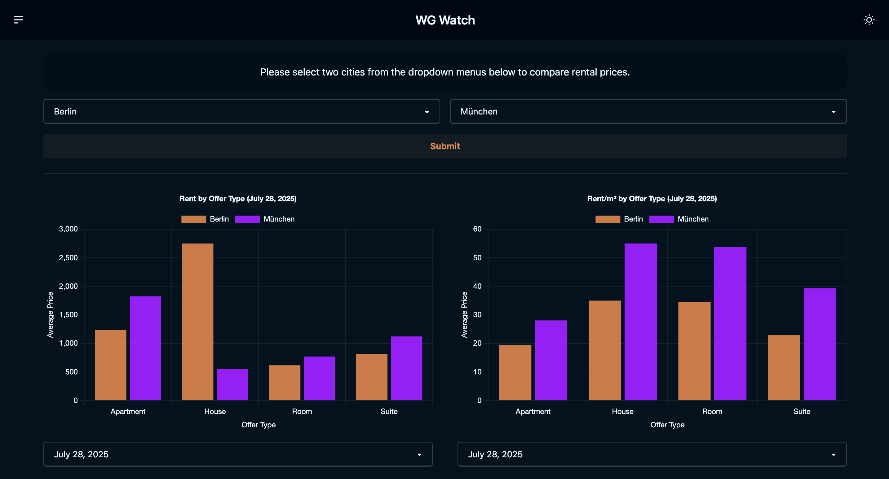
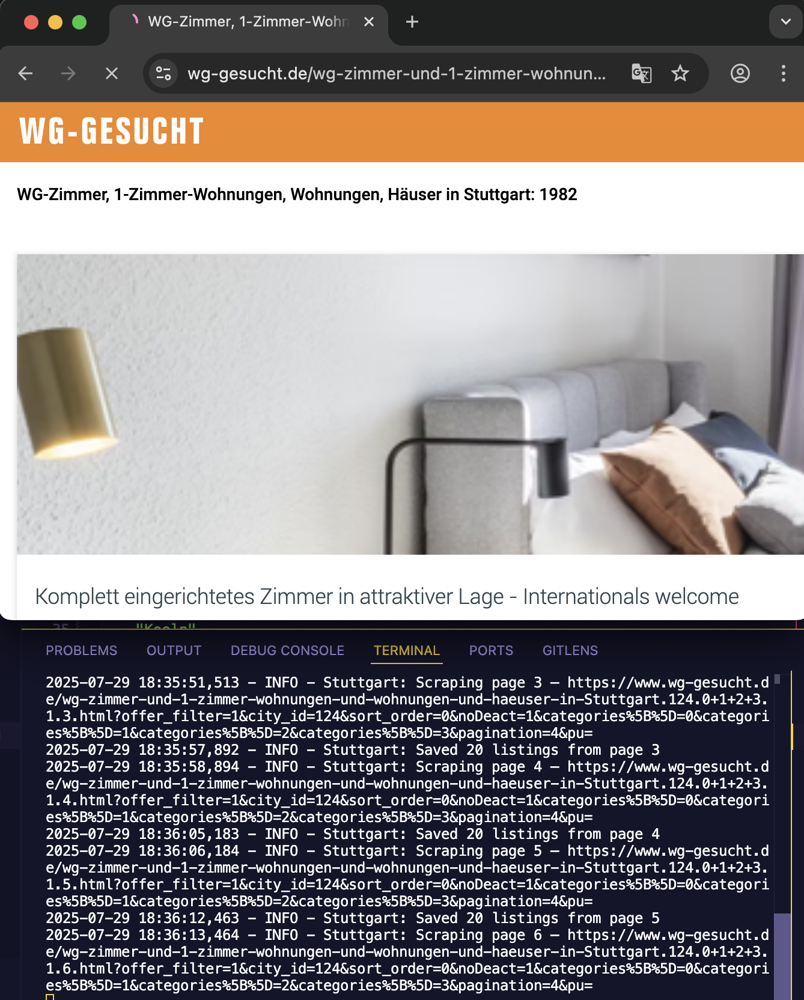

# WG Watch

This repository contains:

- A scraper for [wg-gesucht.de](https://wg-gesucht.de/): `./scraper`
- Data preparation script to run after scraping: `.data_prepper`
- A Django app serving a dashboard visualizing the scraped data: `wgwatch`

You can access the deployed Django app [under this link](https://wg-watch-137914338338.europe-west1.run.app/).

**UI:**



**Scraper:**



**Note: This folder is currently contains staticfiles including JS libraries. The libraries should actually be installed in during docker build but I haven't come around to doing that yet. Django's collectstatic should ideally be run during the build as well.**

## Run locally

Use [uv](https://docs.astral.sh/uv/getting-started/installation/) to install Python & dependencies:

```sh
uv python install 3.13
uv sync
```

Then run the scraper via:

```sh
# SCRAPER_CITIES is optional, if not set all 10 cities
# will be crawled
SCRAPER_CITIES='["Hamburg", "Muenchen", "Berlin"]' python -m scraper.main;
```

where city is one of:

```python
City = Literal[
    "Duesseldorf",
    "Koeln",
    "Berlin",
    "Muenchen",
    "Frankfurt-am-Main",
    "Hamburg",
    "Stuttgart",
    "Leipzig",
    "Dortmund",
    "Bremen",
]
```

Then prepare the scraped data via:

```sh
uv run python -m data_prepper.main
```

Finally you run the Django app with:

```python
LOCAL=true python manage.py runserver
```

Then visit [http://localhost:8000/](http://localhost:8000/).

## Run app in docker

You can directly build & run the docker image via:

```sh
sudo docker build . -t wg
docker run -it -e LOCAL=true -p 8000:8000 wg
```

Then open [http://localhost:8000/](http://localhost:8000/).

# Development

## Tailwind

To compile the tailwind CSS make sure you run the tailwind CLI.

```sh
./wgwatch/static/css/tailwindcss -i wgwatch/static/css/input.css -o wgwatch/static/css/output.css --watch
```

See also [here](https://daisyui.com/docs/install/django/) for the setup. CLI can be installed e.g. via:

```sh
# Run the corresponding command for your OS

# Linux
curl -sLo ./wgwatch/static/css/tailwindcss https://github.com/tailwindlabs/tailwindcss/releases/latest/download/tailwindcss-linux-arm64
curl -sLo ./wgwatch/static/css/tailwindcss https://github.com/tailwindlabs/tailwindcss/releases/latest/download/tailwindcss-linux-arm64-musl
curl -sLo ./wgwatch/static/css/tailwindcss https://github.com/tailwindlabs/tailwindcss/releases/latest/download/tailwindcss-linux-x64
curl -sLo ./wgwatch/static/css/tailwindcss https://github.com/tailwindlabs/tailwindcss/releases/latest/download/tailwindcss-linux-x64-musl

# MacOS
curl -sLo ./wgwatch/static/css/tailwindcss https://github.com/tailwindlabs/tailwindcss/releases/latest/download/tailwindcss-macos-arm64
curl -sLo ./wgwatch/static/css/tailwindcss https://github.com/tailwindlabs/tailwindcss/releases/latest/download/tailwindcss-macos-x64
```
